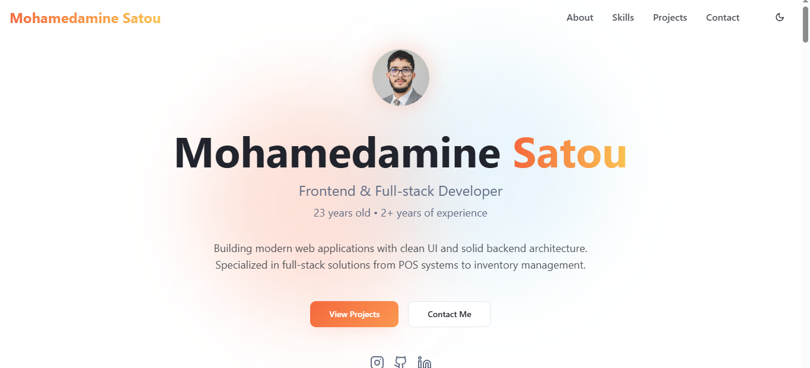

# Mohamedamine Satou - Portfolio

 <!-- optional screenshot -->

## About Me

I'm **Mohamedamine Satou**, a passionate **Frontend & Full-stack Developer** with **2+ years of experience** building modern web applications. I specialize in creating **clean, responsive, and user-friendly interfaces** using **React, Next.js, Tailwind CSS**, and building **robust backend systems** with **Node.js, Express, and SQL databases**.  

I'm currently **looking for work opportunities** where I can contribute to real-world projects and improve my **UI/UX design skills** while delivering high-quality code.

---

## Skills

- **Frontend:** React, Next.js, Tailwind CSS, HTML, CSS, JavaScript  
- **Backend:** Node.js, Express, SQL, JWT Authentication  
- **Tools & Others:** Git, GitHub, Figma (UI/UX design), Vite, Framer Motion  

---

## Featured Projects

### POS / Caisse System
**Role:** Full-stack Developer  
**Description:** Complete point-of-sale solution with real-time inventory tracking and reporting.  

**Tech Stack:** React, Node.js, Express, SQL, JWT Auth  
**Features:**
- Sales register with barcode scanning  
- Automatic receipt generation  
- Real-time inventory updates  
- Daily/monthly sales reports  
- Multi-user authentication & roles  
- Customer management system  

**Case Study:** [View Details](#projects)

---

### E-commerce Perfume Store
**Role:** Frontend & Full-stack Developer  
**Description:** Perfume e-commerce website with smooth product browsing, cart, and checkout experience.  

**Tech Stack:** React, Node.js, Express, SQL  
**Features:**  
- Product listing & filtering  
- Cart & checkout integration  
- Order confirmation emails  
- Admin panel to manage products and orders  

---

### WordPress Food Selling Site
**Role:** Frontend & WordPress Developer  
**Description:** Food selling platform built on WordPress with a custom theme.  

**Tech Stack:** WordPress, PHP, JS, CSS, ACF  
**Features:**  
- Custom theme development  
- Advanced Custom Fields integration  
- Responsive design  
- Client admin panel for content management  

---

### Gym Reservation UI
**Role:** Frontend Developer  
**Description:** Gym booking and classes management UI.  
**Tech Stack:** React, Tailwind CSS, Vite  

---

## Design Approach

I focus on **building modern, intuitive, and visually appealing interfaces**. I enjoy working with **color schemes, typography, and animations** to enhance user experience. My goal is to **combine functionality with design** for real-world applications.

---

## Contact

- **Email:** [aminemohamedsatou@gmail.com](mailto:aminemohamedsatou@gmail.com)  
- **Instagram:** [@satou.dev](https://instagram.com/satou.dev)  
- **GitHub:** [Godjeksatouu](https://github.com/Godjeksatouu)  
- **LinkedIn:** [Mohamedamine Satou](https://www.linkedin.com/in/mohamedamine-satou-469b20221)  

---

## Notes

- All projects are **real-world applications** showing full-stack development expertise.  
- UI/UX improvements are ongoing—always looking to **make interfaces more polished and professional**.  
- This portfolio is designed to **highlight skills and projects** for potential employers or clients.  
